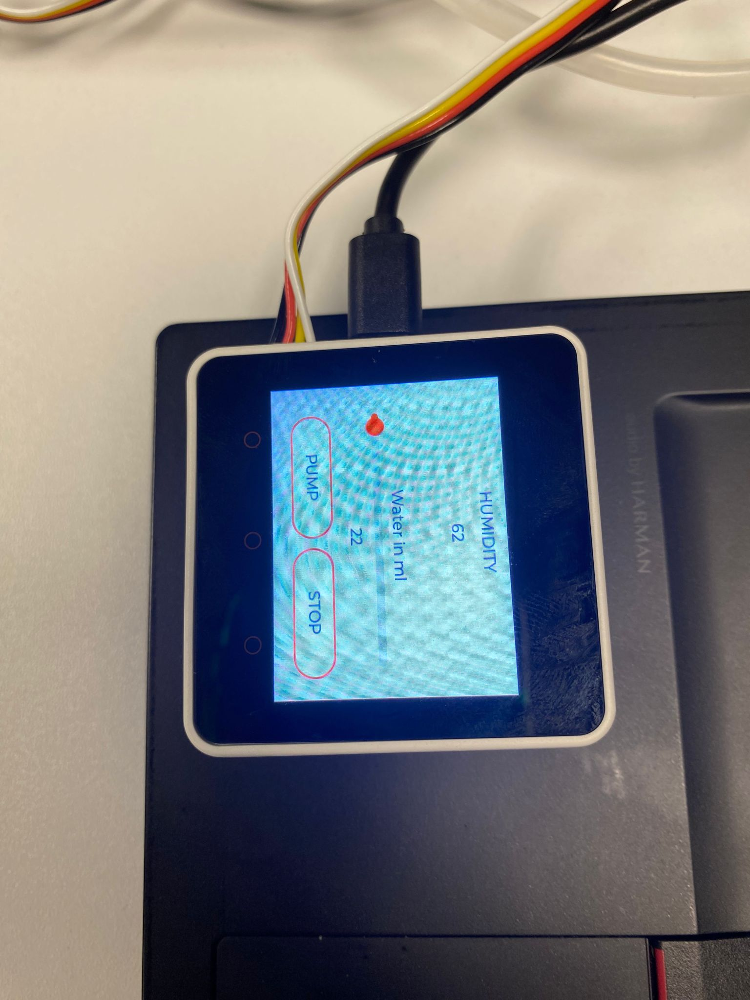

# M5Stack Core2 - Smart Watering System



The Smart Watering System, implemented using the M5Stack Core2 development board, LVGL graphics library, and FastLED, is a project designed to monitor plant moisture levels. It provides real-time measurements and alerts the user when the plant needs watering. The system offers a user-friendly interface that allows the user to control the watering process through the user interface. This project demonstrates the combined capabilities of the M5Stack Core2, LVGL, and FastLED to provide an efficient and interactive solution for automated plant care.

## Quickstart
- Clone the repository
```bash
git git clone https://github.com/Milena-Blaser/m242-LB2-SmartWateringSystem
```

- Open the `core2guidemo` folder with PlatformIO
- Adjust the serial port in `platform.ini` according to your device settings
- Build and upload the code to the Core2

## Database & Grafana
- Open the `BackendMQTTGrafana` folder in IntelliJ or your preferred IDE
- Adjust the ports and credentials in the `docker-compose.yaml` file as desired
- Make sure Docker Desktop is running
- In the terminal, navigate to the project directory and run the command:

```bash
docker-compose up
```

- Access InfluxDB at `localhost:8086` and Grafana at `localhost:3001` (you can change the ports if needed)
- Log in using the credentials specified in the `docker-compose.yaml` file

